# nginx-stress-lab
The primary aim of this application is stress testing the REST endpoint with the help of nginx.


## Architecture Overview

```mermaid
flowchart TB
  A["🐞 Locust UI<br/>(Port 8089)"]
  B["🌀 NGINX Proxy<br/>(Port 8080)"]
  C["🌱 Spring Boot API<br/>(Port 8081 /api)"]
  D["📦 Logstash"]
  E["🔍 Elasticsearch"]
  F["📈 Kibana"]
  G["⏱️ Prometheus"]
  H["📊 Grafana"]

  A --> B --> C
  C --> D --> E --> F
  C --> G --> H

  classDef boxStyle fill:#ffffff,stroke:#333333,stroke-width:1px,rx:5px,ry:5px,font-size:18px;
  class A,B,C,D,E,F,G,H boxStyle;
```



# Quickstart

# 1. Copy configuration
cp .env.template .env
# 2. Launch everything
./run.sh
# 3. Verify services
./check.sh
# 4. Open dashboards:
    - Locust UI:   http://localhost:8089
    - Kibana:      http://localhost:5601
    - Grafana:     http://localhost:3000
    - Prometheus:  http://localhost:9090


nginx-stress-lab is a Docker-based setup for stressing an endpoint. It contains a Spring Boot backend, an NGINX server, and a Locust load-test harness orchestrated through docker-compose.

Key components:

Backend – Spring Boot application listening on port 8081 with a simple REST controller.
Source files: backend/src/main/java/com/stresslab/...
Configuration: backend/src/main/resources/application.properties

Docker Compose – Defines nginx, backend, and locust services. The locust container runs headless tests against the NGINX service.
Config file: docker-compose.yml

Nginx – Custom configuration exposing /ping endpoint and serving a static index page.
Config file: nginx/nginx.conf

Load Testing – load-test/locustfile.py issues simple requests to / and /ping

run.sh – Wrapper script to start the environment via Docker Compose


This project demonstrates a Docker-based environment for stress testing a Spring Boot backend via NGINX using [Locust](https://locust.io/).

Services are orchestrated with Docker Compose:

- **nginx** – serves a static page and proxies requests to the backend.
- **backend** – simple Spring Boot REST API on port `8081`.
- **locust** – load tester that can run in UI or headless mode.

## Prerequisites

- [Docker](https://docs.docker.com/get-docker/)
- [Docker Compose](https://docs.docker.com/compose/)
- [Maven](https://maven.apache.org/)

## Building and Running

1. Build the backend JAR:
   ```bash
   mvn -f backend/pom.xml clean package
   ```
2. Start the stack:
   ```bash
   ./run.sh
   ```
   This script builds images if necessary and starts the services via Docker Compose.

After startup the services are available at:

- **Backend**: <http://localhost:8081>
- **NGINX**: <http://localhost:8080>
- **Locust UI**: <http://localhost:8089>

Stop the stack with `Ctrl+C` or `docker compose down`.

## Tweaking Locust

Locust command-line options are controlled through the `LOCUST_OPTS` environment variable. Copy `.env.example` to `.env` and adjust it or pass the variable directly:

[//]: # (```bash)

# Headless run
LOCUST_OPTS="--headless -u 100 -r 10 --run-time 1m" ./run.sh

# Run with UI and custom spawn rate
LOCUST_OPTS="-u 50 -r 5" ./run.sh


1. NGINX
   What it does:

Acts as a reverse proxy.

Accepts HTTP requests (from browsers, Locust, etc) on localhost:8080.

Forwards /api/ requests to your backend (Spring Boot, port 8081).

How to use:

Open http://localhost:8080 in your browser.

Requests to /api/ (like /api/ping) go to the backend.

Requests to / (static HTML) are served from /nginx/html.

2. Spring Boot Backend
   What it does:

Handles business logic, exposes REST APIs at /api/*, e.g. /api/ping.

Handles authentication (admin/admin, via HTTP Basic Auth).

How to use:

Access backend directly at http://localhost:8081/api/ping (with HTTP Basic Auth).

Normally, you interact with it via NGINX, so most requests go through http://localhost:8080/api/ping.

3. Locust
   What it does:

Load tester: simulates users hammering your NGINX endpoints.

Lets you design user flows (login, API calls) in Python (locustfile.py).

How to use:

Open http://localhost:8089 in your browser.

Use UI to launch test, set number of users, spawn rate, etc.

Or run in headless mode for automated tests (as in your compose file).

Metrics shown in browser UI—see requests per second, failures, etc.

4. Elasticsearch, Logstash, Kibana (ELK Stack)
   What they do:

Elasticsearch: stores log data.

Logstash: ingests, parses, and ships logs to Elasticsearch.

Kibana: provides a dashboard/UI to search, filter, and visualize logs.

How to use:

Visit http://localhost:5601 for Kibana.

Default username: elastic

Password: (Check logs for default or set via env var—often it prints a random password on first run. You can change it!)

You can search and visualize logs sent from Logstash to Elasticsearch.

Logs from NGINX/backend must be sent to Logstash (see below).

5. Prometheus
   What it does:

Scrapes metrics from backend, nginx, or other services (usually via /actuator/prometheus endpoint in Spring Boot).

Stores metrics data (CPU, memory, HTTP requests, custom metrics, etc.).

How to use:

Open http://localhost:9090.

Use Prometheus UI to run queries on collected metrics.

6. Grafana
   What it does:

Visualizes metrics from Prometheus (and many other data sources).

You build beautiful dashboards: CPU, memory, HTTP request latency, errors, etc.

How to use:

Go to http://localhost:3000.

Default login:

Username: admin

Password: admin

On first login, Grafana asks you to change the password (recommended!).

Add Prometheus as a data source (usually auto-detected if running together).

Import or create dashboards.

| Tool       | URL                                            | Username | Password   | Notes                          |
| ---------- | ---------------------------------------------- | -------- | ---------- | ------------------------------ |
| NGINX      | [http://localhost:8080](http://localhost:8080) | (none)   | (none)     | Proxies API to backend         |
| Backend    | [http://localhost:8081](http://localhost:8081) | admin    | admin      | REST API, usually behind NGINX |
| Locust     | [http://localhost:8089](http://localhost:8089) | (none)   | (none)     | Load test UI, live stats       |
| Kibana     | [http://localhost:5601](http://localhost:5601) | elastic  | *see logs* | Log analysis                   |
| Prometheus | [http://localhost:9090](http://localhost:9090) | (none)   | (none)     | Metrics explorer               |
| Grafana    | [http://localhost:3000](http://localhost:3000) | admin    | admin      | First login, set new password  |


How to Use These Tools in Practice
Load Testing:
Use Locust UI to run tests, monitor load on NGINX/backend.

API/Business Logic:
Build and deploy features in the backend. Access via NGINX.

Logging:
Configure backend/nginx to log in a format Logstash understands (JSON preferred).

Metrics/Monitoring:
Add /actuator/prometheus to your backend, Prometheus scrapes it.
View metrics in Prometheus UI, build dashboards in Grafana.

Visualization/Alerting:
Create Grafana dashboards for 95th percentile latency, error rates, etc.
